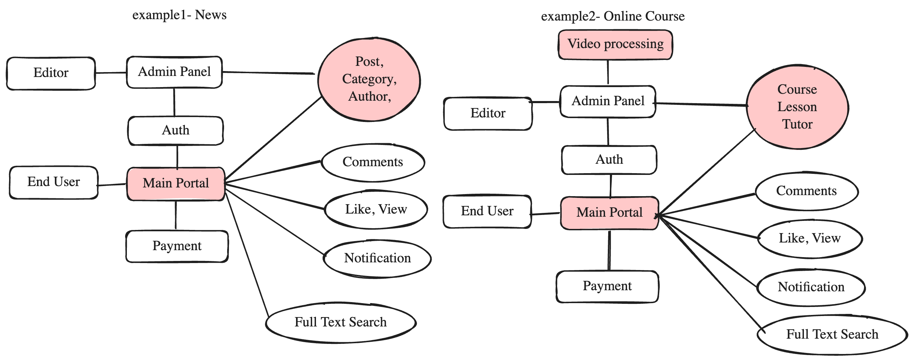
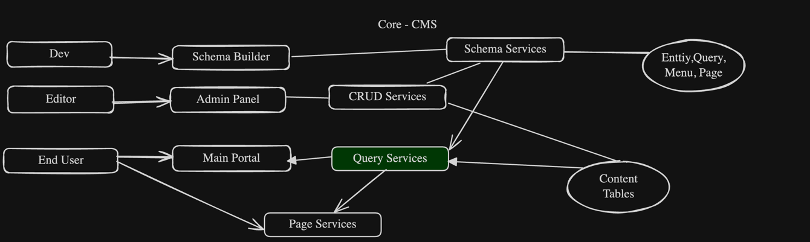
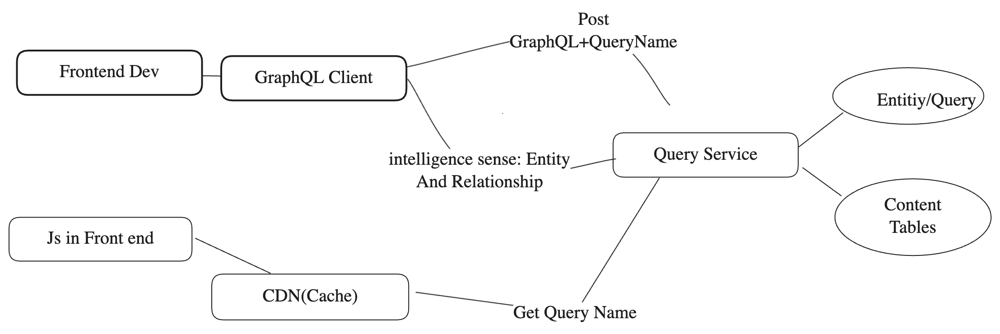
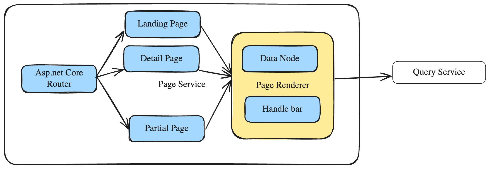
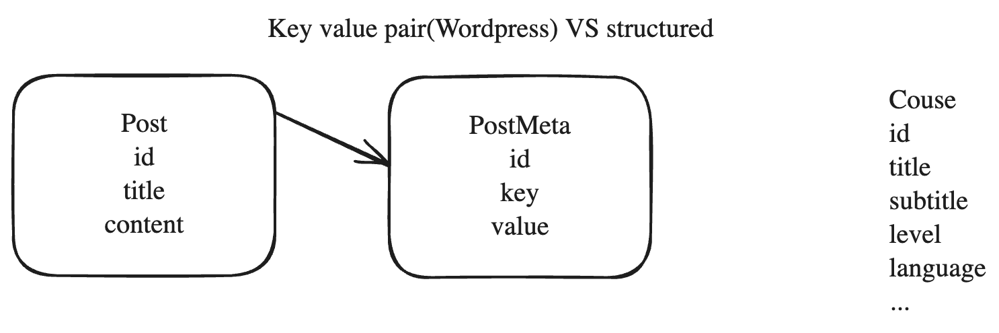
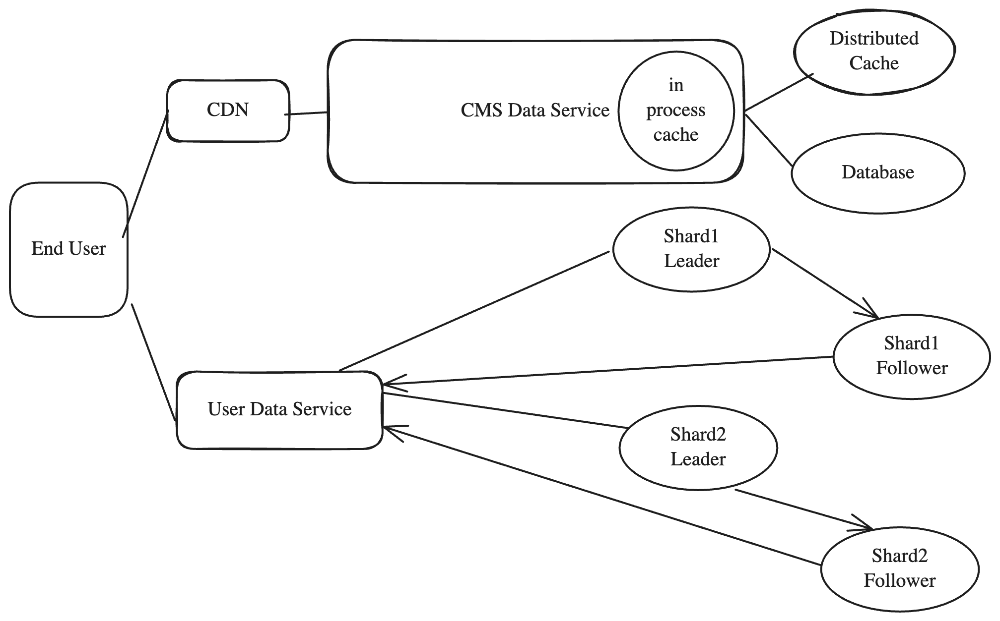
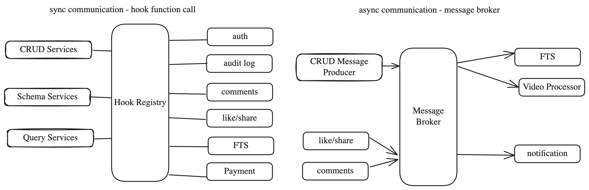

# **FormCMS System Design**

---

# Problem and Scope

The goal of **FormCMS** is to build a backend framework that:

* avoids rebuilding common features each time, and
* simplifies the development workflow.

This helps developers build backends faster for different kinds of projects — like:

* news portals (e.g., *The New York Times*),
* online course platforms (e.g., *Udemy*), and
* video-sharing sites (e.g., *YouTube*).

---

# Objectives

### **Performance**

* For the slowest APIs: P95 latency under 200 ms and throughput over 1,000 QPS on a single app node.
* Handle complex queries (e.g., 5-table joins over 1M rows).
* Support writing and reading from large tables (100M+ records for user activities, views, and scores).

### **Scalability**

* Handle millions of posts, millions of users, and billions of user activities (like view history).

### **Extensibility**

* Let each project customize its own business logic.

---

# High-Level Design

Common CMS features (admin panel, auth, payments, comments, likes, views, notifications, search, etc.) are built into formCMS.    
The system should let developers **define** entities  and  APIs for them.

Instead of writing table schemas, APIs, and docs manually, developers just fill out forms in the **Entity Builder** and **Query Builder** — backend development becomes as simple as completing a form.

---

## Schema Designer

For developers to define entity schemas:

* **Fields:** number, text, varchar, datetime
* **Relations:** one-to-many, many-to-one, many-to-many (via junction tables)

---

## Admin Panel

For editors to add or edit data, with input types like:

* text, image, rich text
* dropdown, lookup, tree, data table

---

## Query

* The **main interface** for frontend developers to build portals.
* Every entity appears as a GraphQL field, with related entities as nested fields.
* The **GraphQL Builder** provides smart code suggestions to make data exploration easy.
* Developers can design flexible queries to load related data efficiently and reduce round trips.
* Queries can be saved as REST endpoints for CDN caching and better security (no technical details exposed).

---

## Page Service – Build Pages Without Code

* Drag-and-drop **page designer** powered by GrapesJS.
* Extend components to include data nodes and bind them to queries.
* Use **Handlebars** syntax to render query results into HTML.
* Support **repeat blocks** for lists, **URL parameters** for cross-page data, and **partial pages** for pagination.

---

# Deep Dive

## Performance

**Test setup:**
PostgreSQL + App Server (4 CPU, 4 GB each)
Tables: post (1M), post_tag (3M), tag (100K), post_cat (2M), category (10K)

| Platform | list20 (p95) | list20 (100VU) | filter by tagId (p95) | filter by tagId (100VU) |
| -------- | ------------ | -------------- | --------------------- | ----------------------- |
| FormCMS  | 48 ms        | 2400 QPS       | 55 ms                 | 2165 QPS                |
| Hasura   | 48 ms        | 2458 QPS       | 53 ms                 | 2056 QPS                |
| Orchard  | 2.3 s        | 30 QPS         | —                     | —                       |

**User Activity Table (100M rows):**

* Read: P95 = 187 ms, ~1000 QPS
* Buffered writes: P95 = 19 ms, ~4200 QPS

**Key factors:**

* Data modeling strategy is critical.
  Most CMSs use key–value fields for flexibility but lose indexing power.
  FormCMS actually creates/updates real tables per schema definition — like a backend developer would — to leverage indexes and keep performance high.
  
* For high-volume activity data, buffer and batch operations improve write speed (cache 10 min, flush every 1 min).
* Cache schemas, avoid N+1 queries, and use unique keys to reduce extra lookups.

---

## Scalability

**CMS Data (cached to scale):**

* Page and query caching via CDN.
* Hybrid caching (in-memory + distributed).
* Example: 1M posts × 10K active posts ≈ 10 GB cache size.

**User Activity Data (sharded to scale):**

* Example: 1M users × 10K views = billions of records.
* Too large to cache; users need real-time updates.
* Shard by user ID (~100M records/shard).
* 100M records ≈ 200 GB (100 GB data + 100 GB index).
* Buffered in memory (~30 GB for 10 min at 5K QPS).

---

## Extensibility

FormCMS is distributed as a **NuGet package**, ready to plug into any project.

* **Hooks:** before/after save, before/after delete
* **Message Broker:** handles CRUD and activity messages
* **Module isolation:** each module owns its own data — updates don’t break others

---

# Wrap-Up

* FormCMS outperforms traditional CMSs and matches the performance of Hasura’s GraphQL engine.
* Scales to medium-sized sites.
  *Example:* The New York Times gets 639 M visits/month.
  Static content is served via CDN; dynamic load (thousands QPS) handled by 4–10 app nodes.
* Growing developer interest: **230 stars**, **25 forks**, **3 active contributors** — the design is appealing to the dev community.